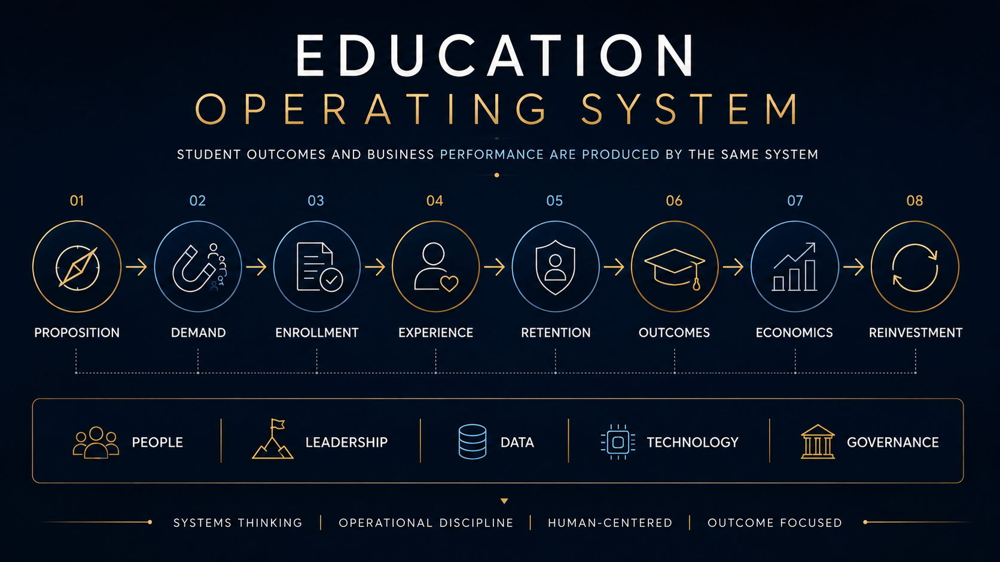

# Education | Building the System Behind Student Outcomes & Sustainable Growth

Building and leading education businesses across international education, Higher Education, EdTech, K-12, student mobility, and AI-enabled learning has reinforced one principle for me:

**Education performance is systemic.**

**Sector:** Education  
**Experience:** Two decades across international education, Higher Education, EdTech, language learning, student mobility, K-12, and education technology  
**Geography:** Latin America | Europe | United States | Global Markets  
**Business Models:** B2C | B2B | B2G | Institutional Partnerships | Education Technology  
**Operating Scope:** P&L | Growth | Enrollment | Student Experience | Retention | Commercial Operations | Partnerships | International Expansion | Leadership

---

## 01. Executive Snapshot

Education organizations manage many visible outcomes.

Enrollment.

Retention.

Student satisfaction.

Completion.

Employability.

Revenue.

Profitability.

But these outcomes are not independent.

They are produced by a connected system.

Across my education career, I have worked on different parts of that system, from student acquisition and country P&L to business turnaround, international expansion, institutional partnerships, EdTech, AI-enabled learning, and executive advisory.

The environments have been different.

The operating principle has remained consistent:

**Do not manage the outcome in isolation. Understand the system producing it.**

An enrollment problem may begin with targeting.

A conversion problem may begin with lead quality.

A retention problem may begin before the student enrolls.

A student-experience problem may originate in operations.

An employability problem can weaken the value proposition before admission.

A growth problem can become an economic problem when acquisition cost, retention, or cost to serve deteriorates.

I think about education as one connected operating system.

Each stage affects what comes after it.

The objective is therefore not simply to put more students into the top of the funnel.

It is to attract the right students, convert them responsibly, deliver the experience promised, keep them engaged, produce outcomes they value, and build economics that allow the institution to continue investing.

> **In education, enrollment is not the end of the commercial process. It is the beginning of the student relationship.**

  

## 02. The Education Operating System

The model starts with the outcome the organization wants and works backward through the drivers producing it.

### Proposition

Before acquisition, there has to be a compelling reason for a student, family, institution, or buyer to choose the offering.

That requires clarity around:

- Market need
- Program or product relevance
- Target customer
- Value proposition
- Pricing
- Expected outcome
- Competitive position

If the proposition is weak or aimed at the wrong customer, the organization eventually compensates through higher acquisition costs, lower conversion, discounting, or greater sales pressure.

The first question is not:

**How do we generate more leads?**

It is:

**Do we have the right proposition for the right customer?**

### Demand & Enrollment

Once the proposition is clear:

**Targeting**
↓
**Channel**
↓
**Qualified Demand**
↓
**Commercial Conversation**
↓
**Application / Admissions**
↓
**Enrollment**

Volume alone is insufficient.

Leadership needs to know which channels produce qualified students, where conversion is being lost, which programs and segments perform, what acquisition costs, and which students ultimately remain and succeed.

That turns enrollment from a target into a manageable system.

### Experience & Retention

Once the student enrolls, the operating responsibility changes.

The promise made during acquisition now has to become an experience.

**Enrollment**
↓
**Onboarding**
↓
**Engagement**
↓
**Learning**
↓
**Support**
↓
**Progress**
↓
**Retention**

Retention should not begin when a student is already leaving.

Organizations need to identify risk earlier through signals such as attendance, engagement, academic progress, financial pressure, service issues, or unresolved complaints.

Then the operating model needs:

**Signal**
↓
**Risk Identified**
↓
**Owner**
↓
**Intervention**
↓
**Follow-Up**
↓
**Outcome**

The objective is to move from measuring attrition to managing retention.

### Outcomes

Education ultimately needs to create value for the learner.

Depending on the model, that can mean:

- Academic progression
- Completion
- Language proficiency
- University access
- Employability
- Career progression
- Skills
- International exposure
- Personal development

Outcomes also strengthen the business.

**Student Value**
↓
**Satisfaction**
↓
**Retention**
↓
**Reputation**
↓
**Referral**
↓
**Future Demand**

In Higher Education, employability is a clear example.

It is not simply a service delivered after graduation. It increasingly forms part of the value proposition before enrollment.

### Economics & Reinvestment

The complete system eventually reaches the economics of the organization.

**Demand**
↓
**Conversion**
↓
**Enrollment**
↓
**Revenue**
↓
**Retention**
↓
**Student Value**
↓
**Cost to Acquire**
↓
**Cost to Serve**
↓
**Contribution**
↓
**Reinvestment**

This is where functional optimization can become dangerous.

Marketing can reduce CPL while generating poorer-quality demand.

Sales can increase enrollment while creating retention problems.

Operations can reduce costs while weakening student experience.

An institution can grow enrollment while deteriorating economically.

The executive responsibility is to see the complete system and determine where intervention will create the greatest value.

> **Sustainable education growth comes from connecting enrollment, experience, retention, outcomes, and economics rather than managing them as separate objectives.**

---

## 03. Operating Across the Education Ecosystem

My education experience has not been limited to one business model or one part of the student journey.

### International Education

At EF Education First, I spent 12 years across commercial leadership, country management, business turnaround, and global responsibilities.

The work included:

- Student acquisition
- Sales and conversion
- Customer experience
- Country operations
- P&L
- Business turnaround
- Partnerships
- International mobility
- Leadership development
- Multi-market execution

It provided direct exposure to the relationship between commercial performance, student delivery, organizational capability, and economics.

### K-12

K-12 introduces a different stakeholder system.

**Educational Proposition**
↓
**Family Expectations**
↓
**Admissions**
↓
**Student Experience**
↓
**Academic Delivery**
↓
**Family Engagement**
↓
**Retention**
↓
**Student Outcomes**
↓
**Reputation**

The student is at the center, but families, teachers, school leadership, and platform leadership all influence the result.

At platform level, another layer appears:

- School performance
- Enrollment and retention
- Talent and leadership succession
- Shared services
- Technology
- Capital allocation
- Campus investment
- Expansion
- Acquisitions
- Integration

The management challenge is to create scale where common systems add value while preserving local leadership where proximity produces better judgment.

### Higher Education

Higher Education connects:

**Program Relevance**
↓
**Student Recruitment**
↓
**Admissions**
↓
**Student Experience**
↓
**Retention**
↓
**Completion**
↓
**Employability**
↓
**Institutional Reputation**

Through TLEO, I have worked on the institutional and international-growth side of this market, including university acquisition, partnership development, student recruitment models, GTM, market prioritization, and expansion across Latin America.

The work reinforces a fundamental point:

A university cannot completely separate recruitment from the value students ultimately receive.

Program relevance, experience, outcomes, and employability strengthen or weaken the commercial proposition itself.

### EdTech & AI-Enabled Learning

Technology changes how education can be delivered, personalized, measured, and scaled.

But a strong product does not automatically create a strong education business.

My work with EdTech and AI-enabled learning businesses, including Speechbound, has involved questions around:

- GTM
- Customer segmentation
- Positioning
- Commercial models
- Adoption
- Growth
- AI-enabled workflows

The core questions remain:

Who uses the product?

Who buys it?

What problem does it solve?

What drives adoption?

How is value demonstrated?

What drives continued usage?

How does the business scale economically?

> **Technology is part of the education system. It is not a substitute for understanding the learner, customer, institution, or outcome.**

### Executive Advisory

Through N34, I apply operating experience across education businesses at different stages of development.

The work includes areas such as:

- GTM strategy
- Revenue systems
- Market expansion
- Operating model design
- Commercial execution
- Organizational capability
- Leadership
- AI-enabled transformation

The objective is not to transfer the same solution from one company to another.

It is to identify which operating principles transfer and adapt them to the specific institution, customer, market, and business model.

---

## 04. Selected Operating Evidence

The operating model above comes from managing real businesses and real performance problems.

Different mandates required intervention in different parts of the system.

### Business Turnaround

In one country turnaround, commercial conversion was weak, customer acquisition economics had deteriorated, churn was high, and the operation was underperforming financially.

The intervention connected commercial execution, customer experience, management discipline, and economics.

Results included:

- Conversion increased from approximately **1.5% to 3%**
- CAC declined from approximately **22% to 12%**
- Churn declined from approximately **22% to 12%**
- The operation returned to **profitability within approximately 12 months**

Several connected indicators improved together.

That was stronger evidence of business improvement than any individual KPI.

### Peru | From Six Years of Losses to Profitability

In Peru, I inherited an education business that had experienced six consecutive years of stagnant performance and operating losses.

We worked across the system:

- Localized demand generation
- Marketing and sales alignment
- Funnel management
- School and strategic partnerships
- Commercial execution
- Organizational structure
- Accountability
- Economics

Results included:

- Approximately **40% revenue growth**
- Landing-page conversion approximately **doubled**
- Organic lead generation increased approximately **55%**
- New customer acquisition increased approximately **30%**
- The business delivered the **first profitable year in its history**

The answer was not more activity.

It was changing the system producing the result.

### Chile | Growth With Stronger Economics

In Chile, the objective was different.

The business was functioning. The challenge was to grow without weakening the economics or organization behind that growth.

We expanded national commercial coverage, strengthened marketing and sales integration, and improved targeting and qualification.

Results included:

- Approximately **30% revenue growth**
- Two regional sales hubs generating approximately **12% incremental revenue**
- SQL quality improved approximately **25%**
- CPL declined approximately **18%**
- EBITDA grew approximately **17%**
- Chile became EF's **second-largest business in Latin America**

Growth and efficiency were not competing objectives.

The system needed to produce both.

### Global | Replicating Without Blindly Copying

At global level, the challenge moved from improving one country to building a model capable of supporting an education business across more than **15 international markets**.

That required connecting:

**Global Proposition**
↓
**GTM**
↓
**Market Leadership**
↓
**Localization**
↓
**Commercial Execution**
↓
**KPIs**
↓
**Governance**
↓
**Local Learning**

The business delivered approximately **35% year-over-year recurring revenue growth** while operating through a matrix organization of more than **90 professionals**.

The principle was important:

**What works in one market should not automatically be copied into another.**

The principles can travel.

Execution needs to reflect the market.

### Higher Education | From Market Opportunity to Execution

Through TLEO, the system is viewed from another side.

The customer can be the university and the growth opportunity international.

The work connects:

**Institution**
↓
**Program**
↓
**Target Market**
↓
**Student Demand**
↓
**Recruitment Channel**
↓
**Application**
↓
**Enrollment**
↓
**Student Outcome**

Market attractiveness alone is insufficient.

The institution also needs the proposition, distribution, commercial model, partnerships, and operating capability required to compete.

### EdTech | From Product to Adoption

EdTech introduces another operating challenge.

A strong product still needs a system around it:

**Problem**
↓
**User**
↓
**Buyer**
↓
**Value Proposition**
↓
**GTM**
↓
**Adoption**
↓
**Usage**
↓
**Evidence of Value**
↓
**Economics**

Product, education, GTM, adoption, customer experience, and economics eventually meet.

The technology matters.

The system around it determines whether it creates sustained value.

---

## 05. The Executive Agenda

Across K-12, Higher Education, international education, and EdTech, several issues consistently deserve executive attention.

### Enrollment Quality

The question is not only:

**How many students did we enroll?**

Leadership also needs to understand:

- Which channels produce qualified demand?
- Where is conversion being lost?
- Which student profiles are most likely to succeed?
- Which cohorts retain and complete?
- What does acquisition cost?
- What is the economic value of each enrollment?

Enrollment volume without retention or viable economics can create growth that does not strengthen the institution.

### Student Experience & Retention

Student experience begins before enrollment.

The proposition creates an expectation.

The commercial conversation reinforces it.

Onboarding tests it.

The learning experience delivers against it.

Support protects it when problems occur.

Outcomes ultimately validate it.

Retention therefore sits at the intersection of the student mission and institutional economics.

The organization needs early signals, clear ownership, intervention mechanisms, and visibility into whether those interventions work.

### Outcomes & Employability

Students and families make significant investments of time and money.

They increasingly want to understand the likely return.

Particularly in Higher Education:

**Program**
↓
**Skills**
↓
**Employer Relevance**
↓
**Completion**
↓
**Employability**
↓
**Career Outcome**

Education should not be reduced to employment.

But institutions should recognize that outcomes influence how students evaluate their value before, during, and after their studies.

### Leadership & Organizational Capability

Education is people-intensive.

Strategy can be clear at executive level and still fail if the management layer cannot translate it into execution.

The organization needs:

**Direction**
↓
**Clear Roles**
↓
**Decision Rights**
↓
**Management Capability**
↓
**KPIs**
↓
**Operating Cadence**
↓
**Accountability**

The objective is not greater executive control.

It is stronger management throughout the organization.

### Mission & Economics

Education organizations need to produce meaningful student outcomes and sustainable economics.

Those objectives should reinforce each other.

Financially weak institutions eventually lose their ability to invest in teachers, faculty, student support, technology, facilities, programs, talent, and innovation.

Improving economics at the expense of the student proposition creates the opposite problem.

The executive question is:

**What operating model allows the institution to strengthen both?**

### AI

AI will affect both learning and operations.

The opportunity is significant, but the starting point should remain the problem rather than the technology.

**Business or Learning Problem**
↓
**Process**
↓
**Use Case**
↓
**Technology**
↓
**Ownership**
↓
**Adoption**
↓
**Measurement**

AI should improve the system.

Adding AI to a poorly designed process can simply make the wrong process move faster.

### International Expansion

An attractive market is not automatically an executable opportunity.

Leadership needs to understand:

- Student demand
- Competition
- Regulation
- Pricing
- Program relevance
- Brand
- Distribution
- Partnerships
- Local talent
- Operating requirements
- Economics

The question is:

**Do we have the proposition, capabilities, organization, and economics required to win there?**

---

## 06. What I Bring to Education Leadership

My education experience spans operating businesses directly, building and turning around markets, leading P&Ls, developing international operating models, working with institutional partners, and advising education and technology businesses.

The environments differ.

The executive discipline underneath them is consistent.

I bring experience connecting:

**Student Outcomes**
+
**Commercial Performance**
+
**Operations**
+
**People**
+
**Technology**
+
**Economics**

rather than managing them as separate agendas.

That includes:

- General management and P&L
- Business turnaround
- Growth and enrollment
- Student experience and retention
- International expansion
- K-12 operating and platform thinking
- Higher Education and institutional partnerships
- EdTech and AI-enabled learning
- Leadership and organizational capability
- GTM and revenue systems
- Multi-market execution

The common capability is systems thinking.

I do not see enrollment, retention, experience, outcomes, technology, people, and profitability as independent management problems.

They interact.

**Proposition**
↓
**Demand**
↓
**Enrollment**
↓
**Experience**
↓
**Retention**
↓
**Outcomes**
↓
**Reputation**
↓
**Growth**
↓
**Economics**
↓
**Reinvestment**

The executive responsibility is to understand those connections, identify the constraint, and determine where people, capital, technology, and management attention will create the greatest impact.

---

## The Operating Principle

If I had to reduce my approach to education to one operating principle:

> **Do not manage the outcome in isolation. Build the system capable of producing it.**

If enrollment needs to grow, understand what creates qualified demand.

If conversion is weak, understand where the funnel is breaking.

If retention is declining, identify the signals before students leave.

If student experience is inconsistent, understand the journey and ownership.

If employability matters, connect it to the program and student proposition.

If growth is weakening profitability, understand the economics behind it.

If AI can create value, start with the problem it needs to solve.

If the organization is expanding internationally, determine what should scale and what needs to remain local.

**Understand the System**
↓
**Find the Constraint**
↓
**Change What Matters**
↓
**Measure**
↓
**Learn**
↓
**Improve**

The outcome is visible.

The executive work happens underneath it.

---

## Confidentiality

This case brings together operating experience and executive perspectives developed across multiple education businesses, markets, and advisory engagements.

Company-specific examples and performance indicators are included where they can be disclosed appropriately.

Client names, student information, commercially sensitive data, internal strategies, pricing, contracts, proprietary information, and confidential engagement details have been omitted or generalized.

The purpose is to demonstrate the operating principles, management judgment, and education-sector experience behind the work without disclosing confidential information.
