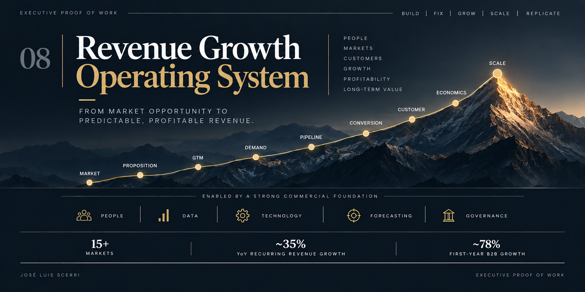

  

# Revenue Growth Operating System

### Building the system that turns market opportunity into predictable, profitable revenue.

**Executive Scope:** CRO | Chief Commercial Officer | Managing Director | CEO  
**Markets:** US | Europe | LATAM | Global  
**Commercial Models:** B2C | B2B | B2B2C | Partnerships | Subscription | Institutional  
**Mandates:** Build | Turnaround | Growth | Scale | Replication

---

## 01. CRO Executive Snapshot

I have spent much of my career **building, fixing, and scaling revenue organizations**.

The environments have changed. The underlying management challenge has not:

> **How do you turn market opportunity into repeatable, profitable revenue?**

My experience covers the full commercial system:

**Market → Proposition → GTM → Demand → Pipeline → Conversion → Customer → Retention → Economics → Scale**

Across different companies and stages of growth, I have:

- Built commercial organizations from zero
- Turned around underperforming revenue engines
- Launched and scaled businesses across international markets
- Built B2C, B2B, and B2B2C growth models
- Developed strategic partnership and distribution channels
- Improved acquisition economics and conversion
- Reduced churn and increased customer lifetime value
- Built forecasting and commercial management disciplines
- Connected revenue growth with profitability
- Created commercial models that could be replicated across markets

The operating pattern has been consistent:

> **Build what is missing. Fix what is broken. Grow what works. Scale what performs. Replicate what can travel.**

---

## 02. Revenue Leadership Scorecard

| Revenue Mandate | Selected Evidence |
| --- | --- |
| **Global Revenue Build** | **15+ markets** · ~35% YoY recurring revenue growth · 90+ person international matrix organization |
| **LATAM Turnaround** | Conversion **~1.5% → ~3%** · CAC **~22% → ~12%** · Churn **~22% → ~12%** · Profitability restored within 12 months |
| **Spain Scale-Up** | **~6% market share** · ~62% of annual revenue through enterprise and telecom partnerships · CAC reduced ~46% |
| **LATAM Market Build** | SQL flow **+~50% in six months** · Conversion **~3x** · Sales cycle **~3–4 months → ~3–4 weeks** |
| **B2B Engine Build** | Built from zero to **30+ representatives** · ~78% first-year revenue growth · ~40% operating margins |
| **Customer Economics** | Nextory LTV approximately doubled · Crimson CAC reduced ~35% and LTV approximately doubled |
| **Distribution & Partnerships** | ~62% of annual revenue through partnerships in one market · ~30–40% of SQL flow through partnerships in another |

These results came from different businesses, geographies, commercial models, and stages of growth.

**The common denominator was not one sales methodology.**

It was the ability to understand the business, identify the constraint, and build the commercial system the situation required.

---

## 03. How I Build Revenue

### BUILD

Create commercial capability where little or none exists.

**Market → Proposition → GTM → Demand → Pipeline → Conversion → Customer**

Typical priorities:

- Market selection
- Customer segmentation
- Value proposition
- GTM architecture
- Commercial organization
- Distribution
- Partnerships
- Sales process
- Revenue management

**Objective:** create a commercial engine capable of producing revenue.

---

### FIX

Find where growth is breaking and correct the system behind it.

**Demand → Pipeline → Conversion → CAC → Retention → Margin**

Typical questions:

- Are we targeting the right customer?
- Is demand sufficient and qualified?
- Is pipeline real?
- Where is conversion leaking?
- Is the sales cycle too slow?
- Is acquisition too expensive?
- Are customers staying?
- Is growth economically attractive?

**Objective:** identify the constraint, intervene, and measure whether performance improves.

---

### GROW

Increase the productivity of the commercial engine.

Growth can come from:

- Better segmentation
- Stronger demand generation
- Higher conversion
- Pricing
- Larger customer value
- Partnerships
- Better sales productivity
- Retention
- Expansion
- Referrals

**Objective:** increase revenue without losing control of customer quality, acquisition cost, or margin.

---

### SCALE

Make growth repeatable.

**People | Process | Data | Technology | Forecasting | Governance**

Scale requires:

- Clear ownership
- Leadership depth
- Productive commercial capacity
- Pipeline discipline
- Reliable forecasting
- Management cadence
- Performance visibility
- Strong customer economics

**Objective:** build an organization that can grow without losing control.

---

### REPLICATE

Transfer what works across markets, products, channels, and teams.

I have done this across international markets while adapting execution to:

- Customer behavior
- Local competition
- Pricing
- Channels
- Partnerships
- Market maturity
- Cultural context

> **Transfer the principle. Adapt the execution.**

---

## 04. Selected Revenue Leadership Evidence

### 01 | Global Revenue Build

**EF Education First | VP Sales & Marketing, Global**

Helped build and scale a new global business across **15+ international markets** in Europe, Asia, and the Americas.

The mandate combined:

- GTM
- Commercial strategy
- Market execution
- Partnerships
- Localization
- Performance management
- International leadership

The organization grew to more than **90 professionals** working through an international matrix.

**Selected outcomes**

- **~35% YoY recurring revenue growth**
- Business scaled across **15+ international markets**
- France approximately **23% growth**
- Italy approximately **22% growth**
- Spain approximately **15% growth**
- Global partnership and campaign strategy generating **$100M+ in earned media value**

At this scale, direct control was impossible.

The model required common commercial standards, clear market ownership, strong local leadership, performance visibility, and enough freedom for markets to adapt execution.

> **Create the framework globally. Enable execution locally.**

**[View the full EF leadership progression →](../04-from-market-turnarounds-to-global-scale)**

---

### 02 | LATAM Revenue Turnaround

**EF Education First | Managing Director, LATAM**

Inherited a business that had lost momentum.

The symptoms were visible:

- Demand weakening
- Conversion low
- Sales cycle too long
- CAC high
- Churn high
- Partnership channels weakened
- Profitability under pressure

My conclusion:

> **This was not simply a sales problem. It was a system problem.**

We rebuilt the connections between GTM, demand generation, sales execution, partnerships, customer experience, management, and accountability.

**Selected outcomes**

| Metric | Before | After |
| --- | ---: | ---: |
| Lead Response | ~5 days | **24 hours** |
| Conversion | ~1.5% | **~3%** |
| Sales Cycle | ~3 months | **~6 weeks** |
| CAC | ~22% | **~12%** |
| Churn | ~22% | **~12%** |
| NPS | ~35 | **~76** |
| Partner Contribution | Underdeveloped | **~18–20% of revenue** |
| Profitability | Under pressure | **Restored within 12 months** |

Several revenue drivers improved together because the system behind them changed.

> **Do not manage the number. Manage what produces the number.**

**[View the full LATAM turnaround →](../01-latam-business-turnaround-operating-system-redesign)**

---

### 03 | Spain Commercial Scale-Up

**Nextory | Country Manager, Spain**

Nextory had already entered Spain through an acquisition.

The next challenge was scale.

The market needed:

- Stronger local commercial infrastructure
- Additional distribution
- Better acquisition economics
- Stronger retention
- A developed partnership engine

One decision became particularly important.

**Direct digital acquisition could not carry the entire growth burden.**

We developed additional routes to market through enterprise and telecom partnerships while improving direct customer economics.

**Selected outcomes**

- **~6% market share**
- **~62% of annual revenue** generated through enterprise and telecom partnerships
- CAC reduced approximately **46%**
- Churn improved from approximately **42% → ~29%**
- ACV increased approximately **35%**
- Gross margin improved approximately **12%**
- Customer lifetime value approximately **doubled**

This was not simply a sales build.

It was a redesign of how the market **acquired, monetized, retained, and expanded customer value**.

> **Growth is stronger when the customer proposition and the business economics improve together.**

**[View the full Nextory case →](../02-nextory-spain-market-scale-up-and-commercial-engine-build)**

---

### 04 | LATAM Market Build & Replication

**Crimson Education | Country Manager → Chief Operating Officer**

Joined Crimson to build and scale its LATAM operation from a limited regional base.

The starting point included:

- No established regional GTM
- Limited local commercial infrastructure
- Pricing requiring regional adaptation
- Underdeveloped institutional partnerships
- Marketing largely managed outside the region
- Low brand awareness

The objective was not simply to open countries.

It was to create a commercial model that could be:

**Localized → Measured → Improved → Standardized → Replicated**

**Selected outcomes**

- SQL flow increased approximately **50% within six months**
- Conversion increased approximately **3x**
- Sales cycle reduced from approximately **3–4 months → ~3–4 weeks**
- Partnerships generated approximately **30–40% of SQL flow**
- CAC reduced approximately **35%**
- Customer lifetime value approximately **doubled**
- Referral activity increased approximately **200%**

The next market could begin with the learning from the previous one rather than starting again from zero.

> **A repeatable expansion model should make the next market easier to build than the previous one.**

**[View the full Crimson case →](../03-latam-market-build-and-global-operating-model-replication)**

---

### 05 | B2B Commercial Engine From Zero

**Brikensa | Regional Sales Director**

Built the commercial organization across Northern Spain from the ground up.

The business sold more than **300 B2B products**.

There was no regional sales organization at the scale required.

The mandate was:

**Build the Team → Create Coverage → Develop Capability → Drive Productivity → Protect Margin → Scale**

The organization grew to more than **30 commercial representatives**.

**Selected outcomes**

- Approximately **78% revenue growth in the first year**
- Commercial organization built from zero to **30+ representatives**
- Approximately **€10K–€12K monthly revenue per representative**
- Approximately **40% operating margins**
- Commercial coverage established across Northern Spain

This was one of my earliest lessons in commercial scale:

> **More people do not automatically create more revenue. Capacity creates value when it becomes productive.**

**[View the full B2B commercial build →](../05-building-a-b2b-commercial-engine-from-zero)**

---

## 05. The Revenue Growth Operating System

Revenue is an outcome.

The job of commercial leadership is to understand and manage what produces it.

### MARKET
**Where should we compete?**

Demand · Segmentation · Market attractiveness · Competitive dynamics · Strategic fit

### PROPOSITION
**Why should the customer choose us?**

Problem · Customer · Value · Positioning · Pricing · Commercial promise

### GTM
**How will we reach the customer?**

Direct · Digital · Partnerships · Channels · Institutional · Local execution

### DEMAND
**Can we create enough qualified demand?**

Volume matters.

**Quality matters more.**

### PIPELINE
**Do we have enough real future revenue?**

Coverage · Quality · Velocity · Ownership · Forecastability

### CONVERSION
**Where are we losing customers?**

Qualification · Proposition · Process · Pricing · Capability · Speed · Follow-up

### CUSTOMER
**Does delivery match the commercial promise?**

Acquisition without customer value creates expensive growth.

### RETENTION
**Are customers staying, expanding, and referring?**

Revenue quality continues after the sale.

### ECONOMICS
**Is growth creating economic value?**

CAC · LTV · Pricing · Gross Margin · Contribution · Productivity · Payback

### SCALE
**Can the system grow without losing control?**

People · Leadership · Process · Data · Technology · Forecasting · Governance

---

### The Complete System

> **Market → Proposition → GTM → Demand → Pipeline → Conversion → Customer → Retention → Economics → Scale**

Supported by:

**People | Leadership | Data | Technology | Forecasting | Governance**

---

## 06. The CRO Management System

A revenue strategy becomes useful only when the organization can execute it.

### Management hierarchy

**Revenue Objective**  
↓  
**Revenue Drivers**  
↓  
**KPIs**  
↓  
**Owners**  
↓  
**Operating Cadence**  
↓  
**Decisions**  
↓  
**Actions**  
↓  
**Results**

### The questions I want answered

1. **Where will the revenue come from?**
2. What assumptions support the plan?
3. Do we have enough qualified demand?
4. Is pipeline coverage sufficient?
5. Is the pipeline real?
6. Where is conversion leaking?
7. Is commercial capacity productive?
8. Is pricing creating enough value?
9. Are customers staying?
10. Are the unit economics improving?
11. How reliable is the forecast?
12. What threatens the number?
13. Who owns the intervention?

> **The purpose of forecasting is to improve decisions while there is still time to change the result.**

---

## 07. What I Measure

Different businesses require different metrics.

The principle is consistent:

> **Measure enough of the system to understand what is producing the result.**

| Dimension | Selected Measures |
| --- | --- |
| **Growth** | Revenue · ARR/MRR · New Business · Expansion · Growth Rate · Market Share |
| **Demand** | Qualified Demand · Channel Contribution · CPL · Cost per Qualified Opportunity · Pipeline Creation |
| **Sales** | Pipeline Coverage · Velocity · Conversion · Win Rate · Sales Cycle · ACV · Revenue per Rep · Quota Attainment |
| **Customer** | Retention · Churn · Expansion · LTV · Customer Experience · Referrals |
| **Economics** | CAC · LTV:CAC · Gross Margin · Contribution Margin · Payback · Productivity |
| **Execution** | Forecast Accuracy · Manager Effectiveness · Hiring & Ramp · CRM Quality · Performance Distribution · Decision Velocity |

The sequence matters:

**Metrics create visibility.**  
↓  
**Visibility improves decisions.**  
↓  
**Decisions change execution.**  
↓  
**Execution produces results.**

---

## 08. What This Proves

The cases are different.

**That is the point.**

One required building a B2B commercial organization from zero.

One required scaling a subscription business through partnerships and stronger customer economics.

One required creating and replicating a LATAM market-entry model.

One required repairing an underperforming regional revenue system.

One required scaling a business across more than 15 international markets.

Across them, the recurring capabilities are clear:

- **BUILD** commercial capability where it does not exist
- **DIAGNOSE** what is actually constraining growth
- **FIX** underperforming revenue systems
- **GROW** revenue while improving the engine underneath it
- **SCALE** people, process, data, management, and economics
- **REPLICATE** what works across markets
- **LEAD** organizations capable of producing results without constant executive intervention

---

## The Operating Principle

My approach to revenue leadership is straightforward:

> **Understand how revenue is created. Identify what constrains it. Build the system around the customer and the economics. Develop the people who operate it. Measure what matters. Improve continuously.**

**Revenue growth is not one department.**

It is the output of a system.

**The CRO's job is to make that system perform.**

---

## Related Executive Proof of Work

- **[LATAM Business Turnaround →](../01-latam-business-turnaround-operating-system-redesign)**
- **[Nextory Spain Market Scale-Up →](../02-nextory-spain-market-scale-up-and-commercial-engine-build)**
- **[Crimson LATAM Market Build →](../03-latam-market-build-and-global-operating-model-replication)**
- **[EF: From Market Turnarounds to Global Scale →](../04-from-market-turnarounds-to-global-scale)**
- **[Building a B2B Commercial Engine From Zero →](../05-building-a-b2b-commercial-engine-from-zero)**

---

## Confidentiality

This repository uses only the level of operating and performance evidence required to demonstrate the management systems behind the results.

Customer-level information, confidential pricing, compensation structures, proprietary commercial data, and other sensitive company information are intentionally excluded.
