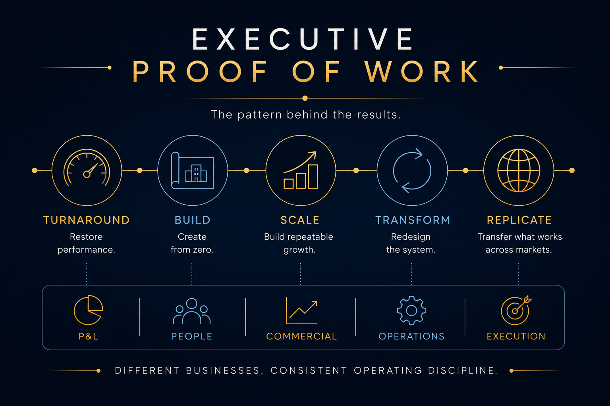

# Executive Proof of Work

### Building the systems that turn business goals into execution and results.

International Managing Director and growth executive with more than two decades of experience building, fixing, and scaling businesses across international markets.

My work has spanned **general management, P&L leadership, revenue growth, GTM, business turnarounds, market expansion, organizational scale, and operating-model design** across education, SaaS, subscription, and technology-enabled businesses.

**Explore:** [Executive Snapshot](#executive-snapshot) · [Headline Outcomes](#headline-outcomes) · [Executive Operating Systems](#executive-operating-systems) · [Executive Progression](#selected-executive-progression) · [Executive Cases](#selected-executive-cases) · [How I Operate](#how-i-operate) · [LinkedIn](https://www.linkedin.com/in/jscerri/)

---

# Executive Snapshot

- **20+ years** of international operating and commercial leadership
- Built and operated businesses across **15+ international markets**
- Led organizations of **100+ people** and international matrix teams of **90+ professionals**
- Experience across **B2C, B2B, B2B2C, partnerships, subscription, and institutional models**
- Built businesses, markets, commercial organizations, partnerships, and operating models from zero
- Led mandates spanning **turnaround, growth, profitability, transformation, market entry, and international scale**

My operating range sits at the intersection of:

**General Management | Revenue | Operations | GTM | Transformation | International Expansion**

---

# Headline Outcomes

## TURNAROUND

**EF Education First | Managing Director, LATAM**

- Conversion approximately **1.5% → 3%**
- CAC approximately **22% → 12%**
- Churn approximately **22% → 12%**
- Profitability restored within **12 months**

**[Read the turnaround case →](./01-latam-business-turnaround-operating-system-redesign/README.md)**

---

## MARKET SCALE-UP

**Nextory | Country Manager, Spain**

- Approximately **6% market share**
- Approximately **62% of annual revenue** generated through enterprise and telecom partnerships
- CAC reduced approximately **46%**
- Customer lifetime value approximately **doubled**

**[Read the Spain scale-up case →](./02-nextory-spain-market-scale-up-and-commercial-engine-build/README.md)**

---

## INTERNATIONAL MARKET BUILD

**Crimson Education | Country Manager → Chief Operating Officer**

- SQL flow increased approximately **50% within six months**
- Conversion increased approximately **3x**
- Sales cycle reduced from approximately **3–4 months to 3–4 weeks**
- Commercial model subsequently replicated across additional international markets

**[Read the market-build case →](./03-latam-market-build-and-global-operating-model-replication/README.md)**

---

## GLOBAL COMMERCIAL SCALE

**EF Education First | VP Sales & Marketing, Global**

- Business scaled across **15+ international markets**
- Approximately **35% YoY recurring revenue growth**
- International matrix organization of **90+ professionals**
- Commercial leadership across Europe, Asia, and the Americas

**[Read the global-scale case →](./04-from-market-turnarounds-to-global-scale/README.md)**

---

## B2B ENGINE FROM ZERO

**Brikensa | Regional Sales Director**

- Commercial organization built from zero to **30+ representatives**
- Approximately **78% first-year revenue growth**
- Approximately **40% operating margins**
- Regional commercial coverage built across Northern Spain

**[Read the B2B build case →](./05-building-a-b2b-commercial-engine-from-zero/README.md)**

---

# Executive Operating Systems

The individual cases show **where I have operated and what changed**.

These operating systems show **how I think about building repeatable business performance**.

They are derived from operating experience rather than management theory.

---

## 07 | Education Business Operating System

### Building education businesses that can grow without losing control of delivery, customer value, or economics.

A practical operating architecture connecting:

**Market → Proposition → GTM → Enrollment → Delivery → Customer → Economics → Scale**

Built around the disciplines that determine whether an education business can grow sustainably:

**Market Strategy | Enrollment & Revenue | Delivery | Customer Experience | Operations | Economics | Leadership | Scale**

Derived from operating experience across education businesses, international markets, turnarounds, growth mandates, and market expansion.

**[Explore the Education Business Operating System →](./07-education-business-operating-system/README.md)**

---

## 08 | Revenue Growth Operating System

### Turning market opportunity into predictable, profitable revenue.

A CRO-level commercial architecture connecting:

**Market → Proposition → GTM → Demand → Pipeline → Conversion → Customer → Retention → Economics → Scale**

Built around five recurring revenue mandates:

**BUILD | FIX | GROW | SCALE | REPLICATE**

Supported by:

**People | Leadership | Data | Technology | Forecasting | Governance**

The system is backed by evidence across global commercial scale, LATAM turnaround, market entry, B2B build, partnerships, acquisition economics, retention, and international replication.

**[Explore the Revenue Growth Operating System →](./08-revenue-growth-operating-system/README.md)**

---

# Selected Executive Progression

The progression matters because the operating perspective developed through increasingly complex mandates:

**Commercial Leadership → Country Management → Turnaround → Multi-Market Build**

**Global Leadership → Executive Advisory**

---

# Selected Executive Cases

These are operating cases, not job descriptions.

Each case shows the **business situation, diagnosis, decisions, execution, management system, and measurable outcomes** behind the mandate.

| # | Executive Case | Company | Role |
| --- | --- | --- | --- |
| **01** | [LATAM Business Turnaround & Operating System Redesign](./01-latam-business-turnaround-operating-system-redesign/README.md) | EF Education First | Managing Director |
| **02** | [Spain Market Scale-Up & Commercial Engine Build](./02-nextory-spain-market-scale-up-and-commercial-engine-build/README.md) | Nextory | Country Manager, Spain |
| **03** | [LATAM Market Build & Operating Model Replication](./03-latam-market-build-and-global-operating-model-replication/README.md) | Crimson Education | Country Manager → COO |
| **04** | [From Market Turnarounds to Global Scale](./04-from-market-turnarounds-to-global-scale/README.md) | EF Education First | Sales Manager → VP Sales & Marketing Global |
| **05** | [Building a B2B Commercial Engine From Zero](./05-building-a-b2b-commercial-engine-from-zero/README.md) | Brikensa España | Regional Sales Director |
| **06** | [From Operating Experience to Executive Advisory](./06-from-operating-experience-to-executive-advisory/README.md) | N34 Executive Strategy & Innovation | Founder & Executive Advisor |

---

# How I Operate

Different businesses require different answers.

The operating sequence is consistent:

> **Goal → Reality → Diagnosis → Priorities → System → Execution → Measurement → Adjustment → Result**

## 1. Start with the outcome

What does the business actually need to achieve?

**Growth? Profitability? Turnaround? Market entry? Scale? Better execution?**

The objective determines what matters next.

## 2. Understand reality

Before redesigning a business, understand how it actually works.

Look at:

- Customers
- Revenue
- Funnel
- Economics
- Operations
- People
- Organization
- Data
- Leadership
- Market dynamics

## 3. Find the constraint

Symptoms are not always causes.

Weak revenue can come from demand, proposition, pricing, sales execution, customer experience, organization, leadership, or economics.

Often several are connected.

## 4. Decide what matters most

Not every problem deserves equal attention.

Leadership requires choosing:

- What changes now
- What waits
- Who owns the intervention
- What success looks like
- What will be measured

## 5. Build or redesign the system

Depending on the mandate, that can mean changing:

**People | Process | GTM | Revenue | Operations | Leadership | Technology | Structure | KPIs**

## 6. Execute

Strategy becomes real through:

- People
- Targets
- Budgets
- Customer activity
- Commercial activity
- Decisions
- Management cadence
- Accountability

## 7. Measure and adjust

The purpose of management information is not reporting.

It is to improve decisions while there is still time to change the outcome.

## 8. Make it repeatable

Once something works:

**Standardize what matters → Build capability → Transfer ownership → Scale → Replicate**

---

# What I Build and Improve

| Area | Operating Focus |
| --- | --- |
| **General Management** | Turning business objectives into priorities, ownership, execution, and results |
| **Revenue** | Building the engine from demand through conversion, retention, and growth |
| **GTM** | Deciding where to play, who to target, how to reach them, and how to win |
| **Operations** | Building the processes and management disciplines required for reliable execution |
| **Leadership** | Putting the right people in the right roles with clear accountability |
| **KPIs** | Measuring what actually tells us whether the business is working |
| **Market Expansion** | Entering new markets and building the local capabilities required to win |
| **Partnerships** | Creating distribution, revenue, capability, and market access |
| **Organization** | Aligning structure, roles, decision rights, and capabilities with strategy |
| **Transformation** | Fixing what prevents the organization from performing |
| **Technology & AI** | Applying technology where it improves decisions, productivity, customer experience, or economics |

These areas are connected.

That is why I think in **systems rather than isolated initiatives**.

---

# Executive Operating System

This Proof of Work repository sits alongside my separate [**Executive Operating System**](https://github.com/jlscerri/executive-operating-system).

The distinction is deliberate.

## Executive Proof of Work

**Where I have put the operating principles into practice.**

- Real mandates
- Real decisions
- Real execution
- Measurable outcomes

## Executive Operating System

**How I approach running, building, and improving a business.**

- Diagnosis
- Priorities
- KPIs
- Operating cadence
- Decision rights
- GTM
- Revenue
- Leadership
- Transformation
- AI
- Market expansion
- Organizational design

Together they answer a question that matters more than a list of titles:

> **How does this executive actually run, build, and improve a business?**

---

# Why This Repository Exists

A CV tells you where someone worked.

A job description tells you what they were responsible for.

Neither tells you enough about **how they operate**.

This repository is designed to make that visible.

The cases show:

- The objective
- The situation
- The diagnosis
- The decisions
- What was built or changed
- How execution was managed
- What was measured
- What changed
- What became repeatable

Business is rarely clean.

The objective is not to make it look that way.

**The objective is to show how I approach real operating problems.**

---

# Confidentiality

These cases come from real companies and real operating situations.

**Trust matters.**

For that reason:

- Sensitive financial information is excluded
- Customer and employee information is protected
- Proprietary pricing and contracts are not disclosed
- Selected results are expressed as percentages, ranges, or directional improvements
- Commercially sensitive internal strategy is intentionally excluded

There is enough evidence to understand the mandate, decisions, execution, and outcomes.

There should never be enough disclosure to compromise the trust of an organization I worked with.

---

# José Luis Scerri

### International Managing Director | Growth | Revenue | Transformation | Global Operations

**General Management · CRO / Commercial Leadership · Operations · GTM · Market Expansion**

> **Building the systems that turn business goals into execution and results.**

**[LinkedIn →](https://www.linkedin.com/in/jscerri/)**
